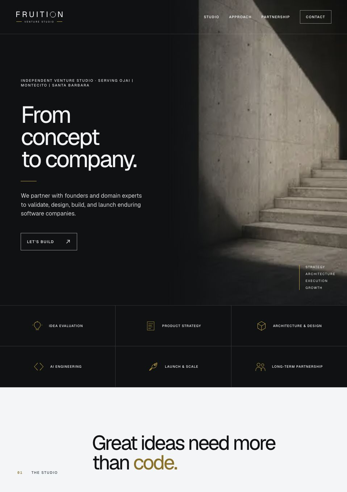
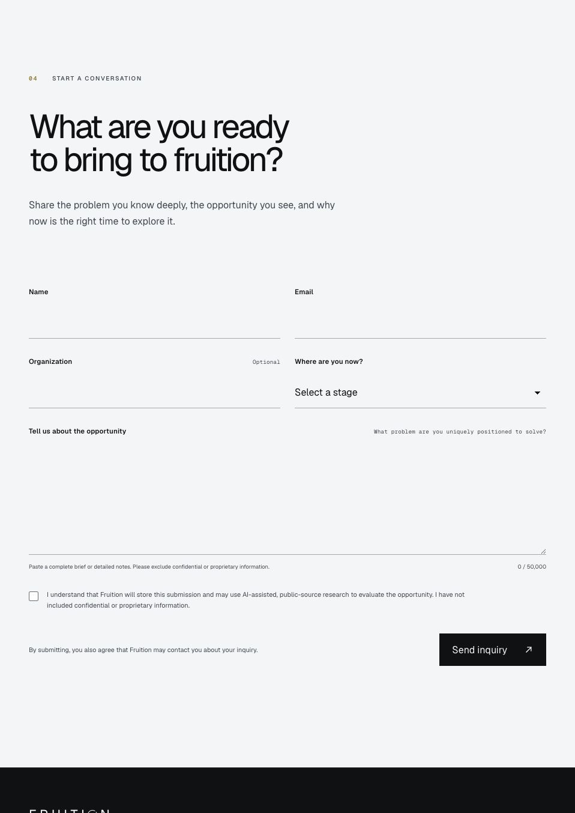
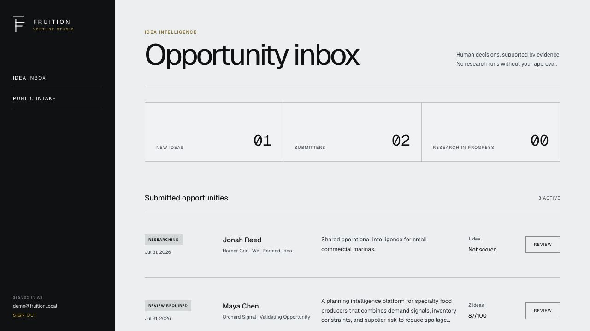
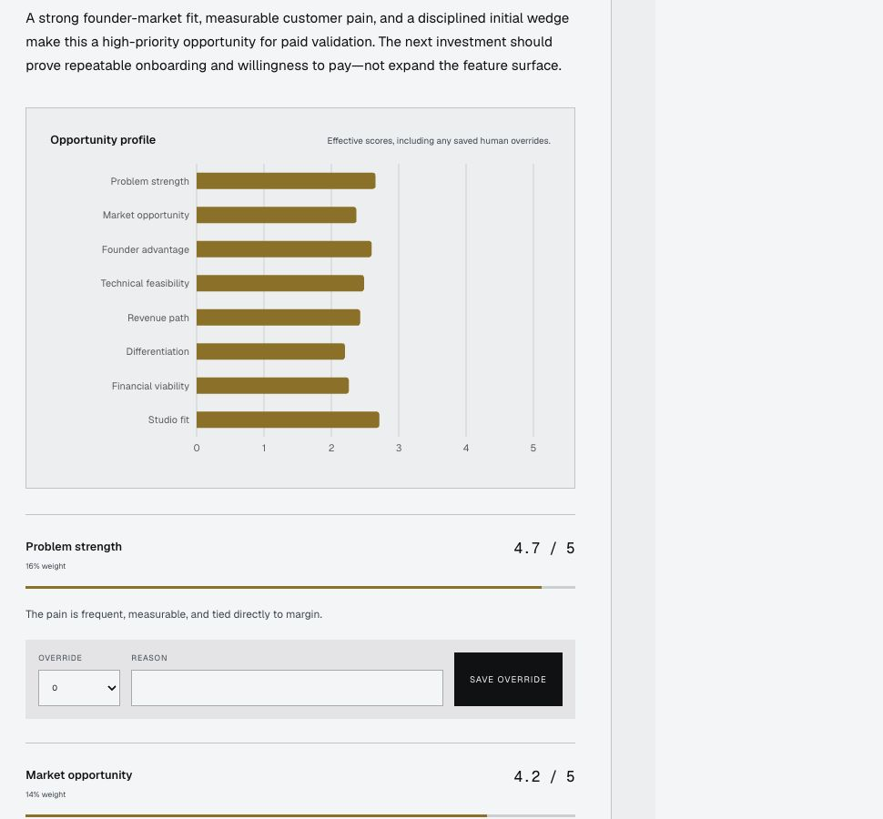
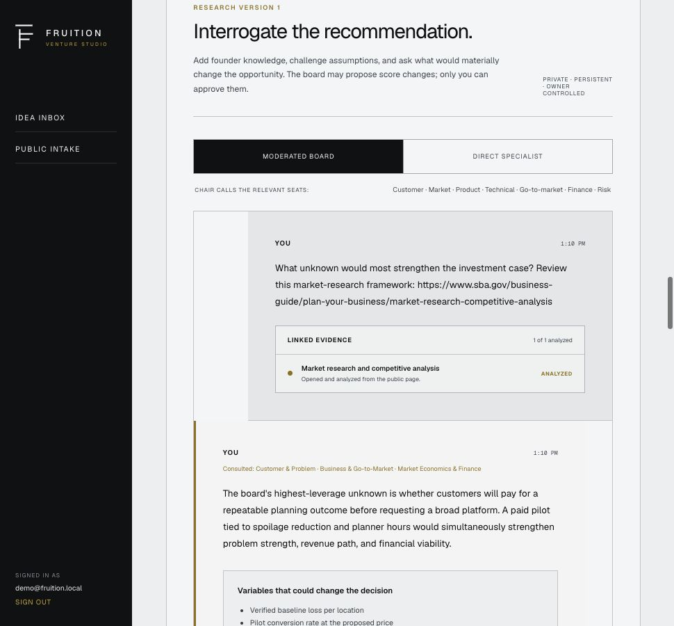
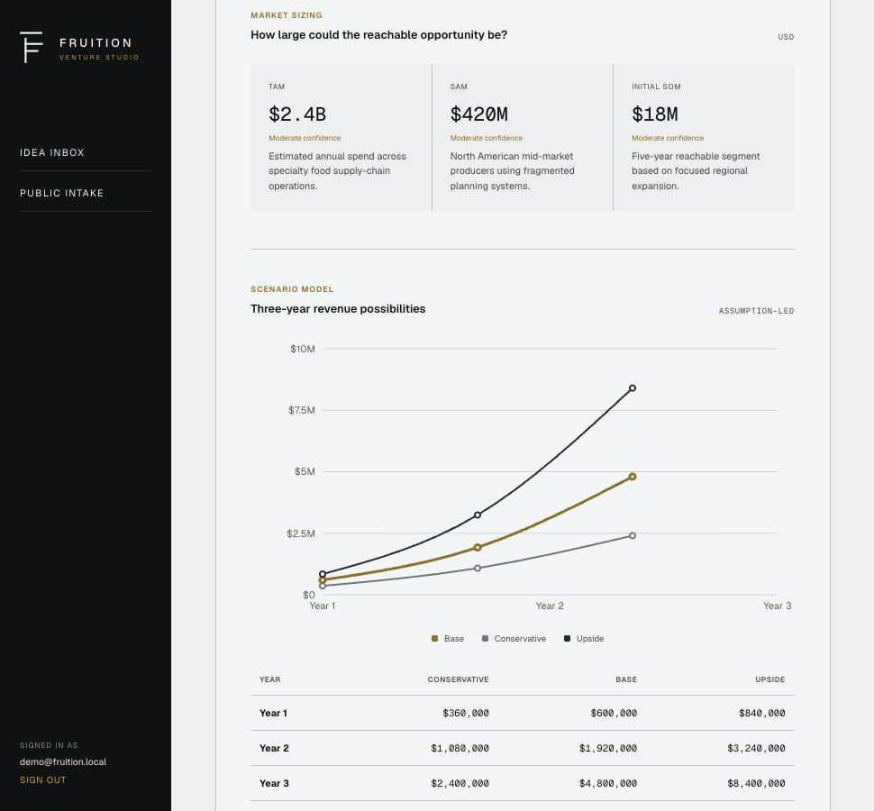

# Fruition Venture Studio

Fruition is an npm-workspace monorepo containing an intentionally simple
public studio site and an independently deployed, owner-only idea-intelligence
admin.

## Product tour

### Public venture studio

The [public site](https://fruition-venture-studio.vercel.app/) introduces the
studio, explains its selective partnership model, and gives founders a direct
path from the brand promise—**From concept to company.**—to a structured idea
submission.



The intake accepts a short inquiry or a detailed brief of up to 50,000
characters. Explicit consent, confidential-information guidance, and clear
stage selection set expectations before anything enters the research system.



### Private idea intelligence admin

The separate owner-only admin turns submissions into a controlled opportunity
pipeline. The inbox shows status, repeat-submitter grouping, active research,
and the latest studio score without exposing admin capabilities to the public
application.

> The admin screenshots below use an isolated, fictional documentation dataset.
> No real founder, email address, submission, or research record is included in
> this repository.



#### Transparent studio scorecard

The synthesis produces a weighted opportunity profile instead of a single
opaque verdict. Every dimension retains its rationale and confidence, and the
owner can record a reasoned human override.



#### Hybrid venture board with verified evidence

The moderated board and direct-specialist conversations let the owner challenge
the recommendation, add founder knowledge, and surface variables that could
change the decision. Pasted public links show their retrieval status and are
saved as untrusted evidence before agents use them.



#### Market economics and venture finance

The finance specialist makes assumptions visible through market sizing,
three-year scenarios, unit economics, cost drivers, and confidence labels.
These are decision models—not forecasts—and remain advisory to the human owner.



## Security boundaries

- `apps/site` contains the public landing page and `POST /api/contact`.
  It has no admin, authentication, OpenAI, Prisma, or Workflow dependency.
- `apps/admin` contains owner authentication, submissions, specialist agents,
  scorecards, and durable research workflows.
- `packages/database` owns Prisma, migrations, and the privileged admin client.
- `packages/contracts` contains public-safe request validation.
- `packages/brand` contains reusable Fruition identity primitives.

The public app connects with a restricted PostgreSQL role. That role cannot
read or change tables and can only execute two narrowly scoped
`SECURITY DEFINER` capabilities:

- `submit_fruition_idea` validates, rate-limits, groups, and stores a
  submission atomically.
- `get_published_founder_brief` returns only a manually published,
  unexpired founder-safe report for a valid private-link token hash.

## Local development

Use Node 24:

```bash
nvm use
npm install
npm run db:generate
npm run dev:site
npm run dev:admin
```

The site runs at [http://localhost:3000](http://localhost:3000). The admin runs
at [http://localhost:3001](http://localhost:3001).

Copy `.env.example` to an ignored local environment file and fill only the
values needed by the app you are running. Local admin development returns a
single-use sign-in URL on screen for an authorized address.

## Containers

Copy `.env.docker.example` to `.env.docker`, replace every placeholder, then:

```bash
docker compose --env-file .env.docker up --build
```

Compose starts PostgreSQL, applies migrations, provisions the execute-only
intake role, and starts the site on port 3000 and admin on port 3001.

The two app Dockerfiles use Node 24, Next.js standalone output, runtime-only
secrets, and a non-root runtime user. Production remains on Vercel's native
Next.js deployment path; the images provide reproducible local and portable
deployments.

## Database operations

The privileged migration connection is used only for migrations:

```bash
npm run db:generate
npm run db:migrate
npm run db:deploy
```

After deploying the secure-intake migration to a managed database, provision
or rotate its intake login without exposing the password in source:

```bash
psql "$DIRECT_URL" \
  -v intake_password="$INTAKE_DB_PASSWORD" \
  -f packages/database/prisma/provision-intake-role.sql
```

Use the resulting `fruition_intake` connection only as
`INTAKE_DATABASE_URL` in the public Vercel project.

Production owner credentials belong only in the repository secrets
`MIGRATION_DATABASE_URL` and `INTAKE_DB_PASSWORD`. Run the
**Migrate production database** GitHub workflow for future schema changes.
Neither Vercel application receives the migration credential.

The admin deployment uses a separate `fruition_admin_runtime` login with
table and sequence data privileges but no database-owner or role-management
capability. Reprovision it with:

```bash
psql "$MIGRATION_DATABASE_URL" \
  -v runtime_password="$ADMIN_RUNTIME_DB_PASSWORD" \
  -f packages/database/prisma/provision-admin-runtime.sql
```

## Vercel projects

Connect this GitHub repository to two projects:

| Project | Root directory | Production-only secrets |
| --- | --- | --- |
| Public site | `apps/site` | `INTAKE_DATABASE_URL`, intake HMAC secret, site-only Resend key |
| Private admin | `apps/admin` | Admin database URLs, auth secrets, admin allowlist, admin Resend key, OpenAI key |

The existing `fruition-venture-studio` project should become the public site
so its URL remains unchanged. Create a second project for `apps/admin`.
Production and preview projects must not share database credentials; use a
separate Neon branch for previews.

After both deployments pass smoke tests, rotate the old combined deployment's
database, authentication, OpenAI, and Resend credentials. Then remove every
privileged variable from the public project. Historical combined deployments
must not retain valid credentials.

## Idea workflow

1. A public submission is validated and stored through the restricted database
   capability.
2. Normalized email groups repeat ideas under one submitter profile.
3. The owner signs into the separate admin and explicitly approves research.
4. Seven bounded specialists collect public-source evidence, including a
   structured market-economics and venture-finance assessment.
5. An eighth agent synthesizes a cited, versioned scorecard.
6. The private venture board supports moderated and direct-specialist
   deliberation. Public links pasted into a board message are retrieved through
   an SSRF-resistant, size-limited pipeline, saved with their retrieval status
   and content hash, and supplied to the agents as untrusted evidence. Returned
   citations are retained only when they match saved research, a successfully
   verified link, or a URL observed in the web-search response.
7. For selected opportunities, the owner may generate and edit a founder-safe
   Opportunity Brief from completed specialist reports. Internal scores,
   notes, dispositions, and board conversations are excluded.
8. External brief delivery requires an explicit human review, a separate
   publish action, and `FOUNDER_BRIEF_PUBLISHING_ENABLED=true` in the admin
   deployment. Published links expire after 90 days and can be revoked or
   reissued.
9. The owner records the disposition and may override scores with a required
   reason.

Agents remain advisory. They cannot contact people, purchase anything, deploy
code, or make venture decisions.

## Verification

```bash
npm run lint
npm run typecheck
npm test
npm run build
docker compose --env-file .env.docker config
```

The approved brand remains architectural and modern, with the tagline:
**From concept to company.**
